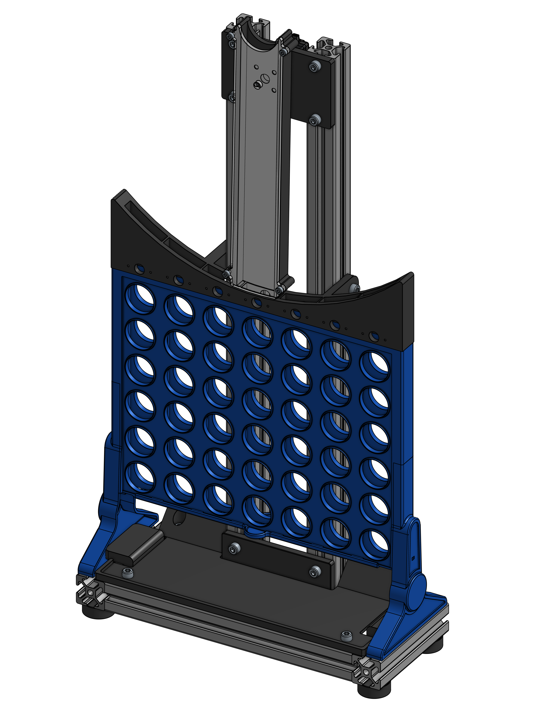

# Connect4Robot
<p align="center">

   </p>

## Overview
Connect4Robot is a Connect 4 game where an AI-powered solver competes against a human player. The game integrates Python logic for decision-making and Arduino for physical interaction using a servo motor to place game pieces on the board. This project demonstrates the combination of AI, robotics, and game mechanics to create an interactive experience. This is the first version, but there are many updates and improvements to come :grin:.

## Features
- **AI Solver**: Utilizes the minimax algorithm with alpha-beta pruning to calculate optimal moves.
- **Human Interaction**: The human player can input their moves via the Python console.
- **Physical Gameplay**: An Arduino-controlled servo motor places pieces in real-time, simulating a physical Connect 4 game.

## Setup
### Requirements
- Python 3.x
- Arduino with a servo motor
- Required Python libraries: `numpy`, `serial`,`pygame`

### Instructions
1. Clone the repository:
   ```bash
   git clone https://github.com/your-username/Connect4Robot.git
   ```
2. Navigate to the project directory:
   ```bash
   cd Connect4Robot
   ```
3. Install Python dependencies:
   ```bash
   pip install numpy pyserial pygame
   ```
4. Upload the Arduino code located in `Arduino/arduinoside.ino` to your Arduino board using the Arduino IDE.
5. Run the Python script for the game:
   ```bash
   python Python/connect4ai.py
   ```
6. Follow the on-screen instructions to play the game.

## How It Works
1. **Game Initialization**: The program at random picks either the human or robot to start 
2. **Human Move**: The human player inputs the column number to place their piece.
3. **AI Move**: The Python solver calculates the best move and sends the column number to the Arduino via serial communication.
4. **Servo Movement**: The Arduino moves the servo to the correct position, dropping the piece, and then resets to the rest position after the human confirms the movement.
5. **Repeat**: The game alternates between human and AI moves until a winner is determined or the board is full.

## Next Steps
- Make the game fully automated with computer vision so no computer input is needed
- add a hopper for the robot
- add a collection system, make the game entirely close loop 

## Credits
- **[zakuraevs](https://github.com/zakuraevs/connect4-ai)**: Base solver and pygame implementation
